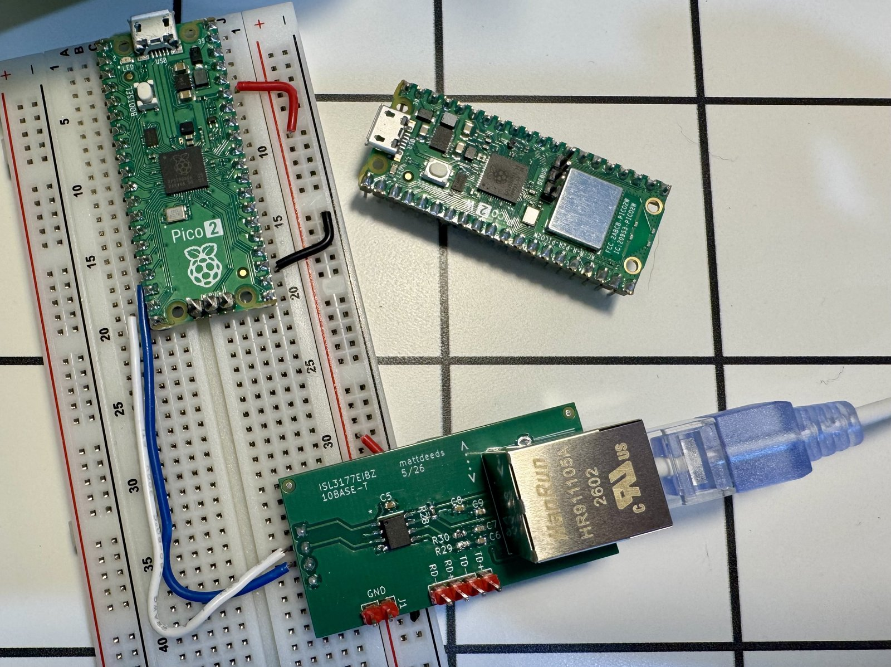

# pico-10base-t-rs

**Software 10BASE-T Ethernet (PIO bit-bang TX *and* RX) and wireless
router on the Raspberry Pi Pico 2 W**. Uses the dual **Hazard3 RISC-V** cores with pure Rust (`no_std`).
A `~$5` micro talks 10 Mbit Ethernet to a real
network with PIO, DMA, a RS-485 transceiver, and magnetics.

Rust port of [C project](https://github.com/mattdeeds/Pico-10BASE-T), which extended
[kingyoPiyo/Pico-10BASE-T](https://github.com/kingyoPiyo/Pico-10BASE-T) (the
original C/PIO Manchester **TX-only** design) with a **RX** path — Manchester
decode over an RS-485 transceiver. This Rust rewrite runs on `rp235x-hal`, exposes
the NIC as a [smoltcp](https://github.com/smoltcp-rs/smoltcp) `phy::Device`, then
grows into a NAPT router with a cyw43 Wi-Fi AP.

## Two builds

The build features give you either layer with no code changes:

- **A standalone software 10BASE-T NIC** (default build): the bit-bang PHY +
  smoltcp. A static-IP host that does ARP / ICMP / UDP / a tiny HTTP server.
- **A wireless router** (`--features router`): the same 10BASE-T as the WAN, a
  cyw43 2.4 GHz AP as the LAN, with L3 forwarding + NAPT between them, a DHCP
  server, and a status page.

## What to expect (performance)

Full detail + method in **[`docs/performance.md`](docs/performance.md)**. Headlines
(measured on real hardware):

| Path | Throughput | Note |
|---|---|---|
| 10BASE-T **TX** (device→host, TCP) | best **~0.95–1.0 MB/s**, typical ~0.4–0.7 | near line rate when clean; half-duplex collision variance |
| 10BASE-T **RX** (host→device, TCP bulk) | **~310 KB/s** @ 0.2% wire loss | stock MTU; ACK-pacing + decode-out-of-IRQ fixes (2026-06) |
| 10BASE-T latency | **~2.6 ms**, 0% loss | |
| Wi-Fi LAN (cyw43 AP) | **~909 down / ~716 up KB/s** | router build |

> **It's a fun software-PHY NIC and a working router, not a
> fast router.** The bit-bang TX is near line rate; RX bulk runs ~310 KB/s
> (the long-suspected "decode/PHY ceiling" turned out to be a fixable
> DMA-starvation bug — see `docs/rx-bulk-ceiling.md` §10). Latency is great;
> ideal for low-rate / IoT-scale traffic.

## Hardware



- **Raspberry Pi Pico 2 W** (RP2350). The plain 10BASE-T NIC build also runs on a
  non-W Pico 2; the Wi-Fi/router builds need the W (cyw43).
- **External 10BASE-T front end:** an **ISL3177E** transceiver + **HR911105A** RJ45
  magnetics. KiCad board design + gerbers/BOM are in [`hardware/`](hardware/).

| Signal | Pico 2 pin |
|---|---|
| ISL3177E `RO` (receiver out → MCU) | GP13 |
| ISL3177E `DI` (driver in ← MCU) | GP14 |
| Onboard LED (heartbeat, NIC build) | GP25 |
| SWD debug probe | SWCLK / SWDIO / GND |

## Toolchain

- Rust ≥ 1.82, target `riscv32imac-unknown-none-elf`
  (`rustup target add riscv32imac-unknown-none-elf`).
- Flashing: [picotool](https://github.com/raspberrypi/picotool) (USB), or OpenOCD
  over SWD:
  `openocd -f interface/cmsis-dap.cfg -f target/rp2350-riscv.cfg -c "program <elf> verify reset exit"`.

## Build & flash

```bash
# Standalone 10BASE-T NIC (static IP 192.168.37.24) — the default build
cargo build --release
cargo run   --release            # flashes via the .cargo/config.toml runner

# Other variants
cargo build --release --features wan-dhcp    # NIC as a DHCP client (WAN-style)
cargo build --release --features wireless    # cyw43 AP only (no wired side)
cargo build --release --features router      # WAN(10BT) + LAN(Wi-Fi) + NAPT router
```

The device logs status over **USB CDC** (assert DTR to read it): `[R2b]` heartbeat,
`[Rx]` decode stats, and on the router build `[Cyw43]` / `[Wan]` / `[Fwd]` / `[Nat]`
/ `[Perf]` lines.

### Wired host setup (10BASE-T peer)

The device emits Normal Link Pulses only (no auto-negotiation), so force the peer
NIC to 10 Mbit half-duplex:

```bash
sudo ethtool -s <iface> speed 10 duplex half autoneg off
sudo ip addr add 192.168.37.19/24 dev <iface>
```

### Router credentials

The cyw43 AP SSID/passphrase are **compile-time placeholders** in
`src/wireless.rs` (`AP_SSID` / `AP_PASSPHRASE = "change-me-please"`). **They should be changed.**

## How it works

- **PIO0** drives the 10BASE-T PHY: **SM0** = 20 MHz Manchester TX (256-entry
  lookup table → single-ended on GP14), **SM1** = 60 MHz RX sampler (`in pins, 1`,
  3 samples/half-bit), **SM2** = a carrier-detect SM for the half-duplex CSMA/CA
  TX gate.
- **DMA** ferries the RX sampler into a double-buffer; **core 1** owns the
  `DMA_IRQ_0` handler running an **edge-tracking DPLL Manchester decoder** + FCS
  (re-anchors to each mid-bit transition to cancel clock drift).
- **core 0** runs smoltcp (the control plane) and, on the router build, an
  **embassy executor** hosting the cyw43 `Runner`, the LAN/WAN net tasks, and the
  custom L3 forwarding + NAPT data path. **PIO1** is a custom gSPI transport to the
  cyw43 radio.
- An **RP2350 hardware watchdog** auto-reboots + recovers the device if the loop
  ever wedges (a known intermittent hang under sustained full-MTU inbound).

## Repo layout

The package is **a library + a binary**: the transport core is a reusable
library crate that other projects can take as a Cargo dependency (e.g.
[pico-remote-probe](https://github.com/mattdeeds/pico-remote-probe), a
network-attached SWD debug probe, uses it as its NIC); the router application
in `src/main.rs` is the in-tree consumer.

- `src/lib.rs` — the **library**: `eth_tx`, `eth_rx`, `eth_rx_dpll`, `eth_mac`,
  `manchester`, `crc` (the **10BASE-T bit-bang NIC**, PHY + MAC), plus
  `multicore_riscv` (Hazard3 core-1 launch), `pico_reset` (picotool USB reset),
  `pio_util`, and — behind the `cyw43-phy` feature — `cyw43_phy` (a smoltcp
  `phy::Device` over the cyw43 radio, no executor required).
- `src/main.rs`, `src/wireless.rs`, `src/forward.rs`, `src/conntrack.rs`,
  `src/dhcp_server.rs`, `src/wan.rs` — the **router** (cyw43 + forwarding + NAPT).
- `docs/` — a thorough **engineering log** (how this was built + characterized).
  Start with [`docs/README.md`](docs/README.md).
- `tools/` — host-side measurement scripts.

## Limitations

Half-duplex (by MAC policy; the transceiver is FD-*capable* but FD only helps
contended traffic); no auto-negotiation; RX bulk ~310 KB/s (next bounds:
decode CPU time and the DMA half-fill ACK-latency floor — see
`docs/rx-bulk-ceiling.md` §10). A hardware watchdog guards against hangs
(the old full-MTU-inbound wedge stopped reproducing after the 2026-06 RX
restructure, but the watchdog stays).
Just an educational project, please don't replace your home router with this.

## Credits

- [kingyoPiyo/Pico-10BASE-T](https://github.com/kingyoPiyo/Pico-10BASE-T) — the
  original C/PIO 10BASE-T **TX** design (MIT, Copyright © 2022 kingyo). This project
  is a Rust port of the author's own
  [C project](https://github.com/mattdeeds/Pico-10BASE-T), which extended
  kingyoPiyo's work with the **RX** path (Manchester decode over an RS-485
  transceiver).
- [Niccle](https://github.com/timonvo/niccle) — a reference for the
  Manchester RX decode approach and circuit design.
- [embassy](https://github.com/embassy-rs/embassy) `cyw43` driver + firmware blobs
  (Infineon permissive binary license — see `cyw43-firmware/`).
- [smoltcp](https://github.com/smoltcp-rs/smoltcp), [rp235x-hal](https://github.com/rp-rs/rp-hal).

## License

Dual-licensed under either **MIT** ([LICENSE-MIT](LICENSE-MIT)) or
**Apache-2.0** ([LICENSE-APACHE](LICENSE-APACHE)), at your option. The cyw43
firmware blobs in `cyw43-firmware/` carry their own (Infineon) permissive license.
